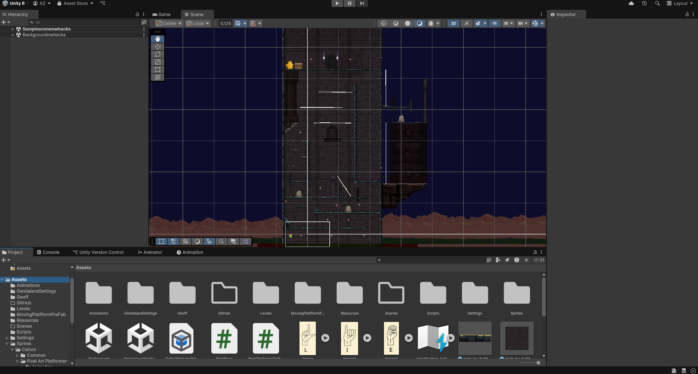

# Croak Quest

### Learn sign language through an immersive Leap Motion-powered 2D platformer, combining education and fun in an interactive Unity experience!

---

## **About the Project**

Croak Quest is a 2D platformer game designed to teach players American Sign Language (ASL) in an engaging and interactive way. Leveraging the Leap Motion Controller, players use real-world hand gestures to control the game, creating an educational and immersive experience.

This project was created for **nwHacks 2025**, where it won the **Best Beginner Project** award! You can learn more on our [Devpost page](https://devpost.com/software/croak-quest) and watch the [demo video](https://www.youtube.com/watch?v=KHt1T8ZliwM).

---
[](https://www.youtube.com/watch?v=KHt1T8ZliwM)

## **Key Features**

1. **Leap Motion Integration**: 
   - Players perform hand gestures to control in-game movements.
   - Responsive character actions mapped to real-life gestures.
2. **Educational Gameplay**:
   - Incorporates ASL signs, allowing players to learn as they play.
3. **Platforming Mechanics**:
   - Classic 2D platformer gameplay with movement, jumping, and obstacles.

---

## **Technologies Used**

- **Unity**: Game development engine for creating the 2D platformer.
- **C#**: Programming language for scripting game mechanics and Leap Motion integration.
- **Leap Motion Controller**: Hardware for capturing and interpreting real-world hand gestures.
- **Git**: Version control for collaborative development.

---


## **Installation**

1. **Clone the Repository**:
   ```bash
   git clone https://github.com/julianchen24/Croak-Quest.git
   cd CroakQuest
   ```

2. **Setup Leap Motion**:
   - Ensure the Leap Motion Controller is set up and calibrated. Refer to the [Leap Motion Setup Guide](https://developer.leapmotion.com/).

3. **Open the Project in Unity**:
   - Open Unity Hub and add the project folder.
   - Launch the project in Unity Editor.

4. **Run the Game**:
   - Press the Play button in Unity to start the game.

---

## **Gameplay Overview**

- **Controls**: Use hand gestures with the Leap Motion Controller to navigate the platformer.
- **Educational Focus**: Learn and practice ASL signs while advancing through the levels.
- **Immersion**: Realistic and responsive gesture-based control enhances the experience.

---

## **Contributors**

- Julian Chen
- Daniel Ma
- Geoff Jiang
- Aaron Zhang

---

## **License**

This project is licensed under the [MIT License](LICENSE). Feel free to use, modify, and distribute this project as per the license terms.

---

## **Contributing**

All contributions are welcome.


